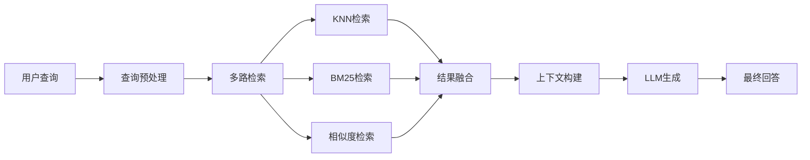

# 🏥 Chinese-MedQA-Qwen2

<div align="center">

**基于 Qwen2 的医疗问答系统 | SFT + RL + RAG + Agent**

[](https://www.python.org/)
[](https://pytorch.org/)
[](LICENSE)
[]

[功能特性](#-功能特性) • [快速开始](#-快速开始) • [模块架构](#-模块架构) • [使用指南](#-使用指南)

</div>

---

## 📖 项目简介

Chinese-MedQA-Qwen2 是一个**全功能医疗问答系统**，整合了现代 NLP 和 LLM 领域的核心技术：

- 🎯 **监督微调 (SFT)**：基于医疗对话数据集微调 Qwen2 模型
- 🎲 **强化学习 (RL)**：使用 DPO/PPO/GRPO 进行偏好优化
- 🔍 **检索增强生成 (RAG)**：结合 FAISS 向量数据库和多种检索算法
- 🤖 **智能体 (Agent)**：医疗场景下的工具调用和多智能体协作
- ⚡ **高效推理**：支持 FastLLM、vLLM、Ollama 等多种推理引擎
- 🌐 **Web 服务**：提供 FastAPI REST API 和 Web UI

---

## 🎯 功能特性

### 🔥 核心亮点

| 功能 | 描述 | 状态 |
|------|------|------|
| **SFT 训练** | HuggingFace Trainer + LLaMA-Factory | ✅ |
| **DPO 训练** | 手写 DPOTrainer 实现 | ✅ |
| **GRPO/PPO** | 基于 TRL/verl 的强化学习 | ✅ |
| **FAISS 检索** | KNN + 相似度 + BM25 + L2 | ✅ |
| **RAG 流水线** | 查询处理 → 检索 → 上下文构建 → 生成 | ✅ |
| **Agent 系统** | 工具调用 + 多智能体协作 | ✅ |
| **FastLLM 推理** | C++ 加速，支持量化 | ✅ |
| **vLLM 推理** | 高吞吐量大规模部署 | ✅ |
| **FastAPI 服务** | RESTful API + 自动文档 | ✅ |

---

## 🏗️ 项目架构

```
MedQA/
├── 📊 数据处理
│   ├── data/                        # 数据目录
│   ├── crawled_data/                # 爬虫数据
│   ├── processed_data/              # 处理后数据
│   └── scripts/web_crawler.py       # 医疗数据爬虫
│
├── 🎓 模型训练
│   ├── src/training/
│   │   ├── trainer/                 # 训练器实现
│   │   │   ├── sft_trainer.py       # SFT 训练
│   │   │   ├── dpo_trainer.py       # DPO 训练（手写）
│   │   │   ├── grpo_from_*.py       # GRPO 实现
│   │   │   └── ppo_from_verl.py     # PPO 实现
│   │   ├── dataset/                 # 数据集处理
│   │   │   ├── medical_dataset.py   # 医疗数据集
│   │   │   └── data_processor.py    # 数据预处理
│   │   └── scripts/                 # 训练脚本
│   ├── train_sft.sh                 # SFT 训练脚本
│   ├── train_dpo.sh                 # DPO 训练脚本
│   └── merge_lora.py                # LoRA 权重合并
│
├── 🔍 RAG 系统
│   ├── src/knowledge_base/
│   │   ├── document_loader.py       # 文档加载（PDF/TXT/JSON）
│   │   ├── document_processor.py    # 文档处理和切分
│   │   ├── embedding_manager.py     # 嵌入模型管理
│   │   ├── kb_manager.py            # 知识库管理
│   │   └── retrieval/               # 检索算法
│   │       ├── knn_retriever.py     # FAISS KNN 检索
│   │       ├── bm25_retriever.py    # BM25 稀疏检索
│   │       ├── similarity_retriever.py  # 相似度检索
│   │       └── l2_retriever.py      # L2 距离检索
│   └── src/rag/
│       ├── rag_pipeline.py          # RAG 核心流水线
│       ├── query_processor.py       # 查询预处理
│       ├── context_builder.py       # 上下文构建
│       ├── response_generator.py    # 回答生成
│       └── rag_demo.py              # 交互式 RAG 演示
│
├── 🤖 Agent 系统
│   └── src/agent/
│       ├── agent_base.py            # Agent 基类
│       ├── medical_agent.py         # 医疗专用 Agent
│       ├── multi_agent_pipeline.py  # 多智能体协作
│       ├── tool_manager.py          # 工具管理器
│       └── tools/                   # 工具集合
│
├── ⚡ 推理引擎
│   └── src/inference/
│       ├── fastllm_inference.py     # FastLLM (C++ 加速)
│       ├── vllm_inference.py        # vLLM (高吞吐)
│       ├── ollama_inference.py      # Ollama 本地部署
│       ├── xinference_inference.py  # XInference
│       └── api_inference.py         # API 调用（智谱等）
│
├── 🌐 服务接口
│   └── src/api/
│       ├── app.py                   # FastAPI 应用
│       ├── routers/                 # API 路由
│       │   ├── rag.py               # RAG 接口
│       │   ├── qa.py                # 问答接口
│       │   ├── embedding.py         # 嵌入接口
│       │   └── evaluation.py        # 评估接口
│       ├── schemas/                 # 数据模型
│       └── services/                # 业务逻辑
│
├── 🔬 模型组件
│   └── src/models/
│       ├── qwen_model.py            # Qwen2 模型封装
│       ├── api_model.py             # API 模型封装
│       └── model_utils.py           # 模型工具
│
├── 📊 评估工具
│   └── src/evaluation/
│       ├── evaluator.py             # 通用评估器
│       └── dpo_quality_evaluator.py # DPO 质量评估
│
└── 🛠️ 工具脚本
    ├── examples/                    # 示例代码
    ├── main.py                      # 主入口
    └── requirements.txt             # 依赖列表
```

---

## 📦 模块详解

### 1️⃣ SFT 模块（监督微调）

#### 功能描述
使用医疗对话数据集对 Qwen2 进行监督微调，使模型学习医疗领域知识。

#### 核心文件
```
src/training/trainer/
├── sft_trainer.py          # 基于 HF Trainer 的 SFT 实现
├── sft_from_trl.py         # 基于 TRL 的实现
├── sft_from_verl.py        # 基于 verl 的实现
└── run_sft.py              # 训练入口
```

#### 数据集格式
```json
{
  "instruction": "患者主诉",
  "input": "补充信息",
  "output": "医生回复"
}
```

#### 快速开始
```bash
# 1. 准备数据集
python process_dataset.py --dataset_name ticoAg/Chinese-medical-dialogue

# 2. 开始 SFT 训练
bash train_sft.sh

# 3. 合并 LoRA 权重
python merge_lora.py --base_model Qwen2.5-1.5B --lora_path ./output/sft
```

#### 训练配置
```python
# 关键参数
learning_rate: 2e-5
batch_size: 4
gradient_accumulation_steps: 8
max_steps: 3000
warmup_ratio: 0.1
lora_rank: 8
lora_alpha: 32
```

---

### 2️⃣ RL 模块（强化学习）

#### 功能描述
使用偏好数据对模型进行强化学习优化，提升回答质量和对齐能力。

#### 支持的算法

| 算法 | 描述 | 实现方式 |
|------|------|----------|
| **DPO** | Direct Preference Optimization | 手写 + LLaMA-Factory |
| **PPO** | Proximal Policy Optimization | verl |
| **GRPO** | Group Relative Policy Optimization | TRL/verl/从零实现 |

#### 核心文件
```
src/training/trainer/
├── dpo_trainer.py          # 手写 DPO 实现
├── DPO原理解释.md          # DPO 原理文档
├── grpo_from_scratch.py    # GRPO 从零实现
├── grpo_from_trl.py        # 基于 TRL
├── grpo_from_verl.py       # 基于 verl
└── ppo_from_verl.py        # PPO 实现
```

#### DPO 数据集格式
```json
{
  "prompt": "患者问题",
  "chosen": "更好的回答",
  "rejected": "较差的回答"
}
```

#### DPO 训练
```bash
# 1. 准备偏好数据
python process_dataset.py --dataset_name Morefreedai/medical-dpo-v1

# 2. 开始 DPO 训练
bash train_dpo.sh

# 或使用 LLaMA-Factory
bash scripts/llama_factory_train.sh
```

#### GRPO/PPO 训练
```bash
# GRPO (从零实现)
python src/training/trainer/run_grpo.py --config configs/grpo_config.yaml

# PPO (verl)
python src/training/trainer/ppo_from_verl.py
```

---

### 3️⃣ RAG 模块（检索增强生成）

#### 功能描述
结合向量检索和文档知识库，为模型生成提供准确的上下文信息。

#### 核心组件



#### 检索算法对比

| 算法 | 类型 | 特点 | 适用场景 |
|------|------|------|----------|
| **KNN** | 稠密检索 | FAISS 加速，精确 | 语义相似度搜索 |
| **BM25** | 稀疏检索 | 关键词匹配 | 精确词汇匹配 |
| **相似度** | 稠密检索 | 余弦相似度 | 通用语义搜索 |
| **L2** | 稠密检索 | 欧氏距离 | 向量空间搜索 |
| **混合** | 混合检索 | 结合多种方法 | 最佳效果 |

#### 核心文件
```
src/knowledge_base/
├── document_loader.py       # 支持 PDF/TXT/DOCX/JSON/MD
├── document_processor.py    # 文档切分和清洗
├── embedding_manager.py     # moka-ai/m3e-base 嵌入
├── kb_manager.py            # 知识库 CRUD
└── retrieval/
    ├── knn_retriever.py     # FAISS KNN (推荐)
    ├── bm25_retriever.py    # BM25 稀疏检索
    ├── similarity_retriever.py
    └── l2_retriever.py

src/rag/
├── rag_pipeline.py          # RAG 核心流水线
├── query_processor.py       # 查询清洗、分词、扩展
├── context_builder.py       # 上下文模板构建
└── response_generator.py    # 生成控制
```

#### 快速使用

##### 方式 1：交互式 RAG 演示
```bash
python -m src.rag.rag_demo

# 运行效果：
# 【阶段 1/4】文档准备
# 【阶段 2/4】初始化 RAG 流水线
# 【阶段 3/4】构建向量索引
# 【阶段 4/4】LLM 加载
# 💬 您的问题: 高血压怎么治疗？
# 🔍 正在检索相关文档...
# ✓ 检索完成 (0.123秒)
# 📄 找到 3 个相关文档
# 💡 AI 回答: ...
```

##### 方式 2：构建向量数据库
```bash
python examples/build_vector_db_demo.py
```

##### 方式 3：API 调用
```bash
# 启动 FastAPI 服务
uvicorn src.api.app:app --host 0.0.0.0 --port 8000

# 创建知识库
curl -X POST "http://localhost:8000/api/rag/kb/medical_kb"

# 上传文档
curl -X POST "http://localhost:8000/api/rag/kb/medical_kb/documents/from-path" \
  -H "Content-Type: application/json" \
  -d '{"file_paths": ["data/medical_docs/"], "recursive": true}'

# 查询
curl -X POST "http://localhost:8000/api/rag/query" \
  -H "Content-Type: application/json" \
  -d '{"query": "高血压治疗方法", "kb_name": "medical_kb", "top_k": 3}'
```

#### RAG 配置参数

##### KNN 检索器配置
```json
{
  "name": "knn_retriever",
  "score_threshold": 0.5,         // 相似度阈值（0-1）
  "embedding_model_name": "moka-ai/m3e-base",  // 嵌入模型
  "index_type": "Flat",           // FAISS索引类型：Flat/IVFFlat/HNSW
  "n_list": 100,                  // IVF 聚类中心数
  "m": 16,                        // HNSW 连接数
  "dimension": 768                // 向量维度
}
```

**参数说明：**
- `score_threshold`: 过滤低相关度文档
- `index_type`: 
  - `Flat`: 精确搜索，小数据集
  - `IVFFlat`: 倒排索引，中等数据集
  - `HNSW`: 图索引，大数据集，高召回
- `n_list`: 聚类数量，越大搜索越慢但越准
- `m`: HNSW 图连接数，影响召回率
- `dimension`: 必须与嵌入模型输出维度一致

---

### 4️⃣ Agent 模块

#### 功能描述
智能体系统，支持工具调用、思维链（CoT）、多智能体协作。Agent 可以自主调用工具（如药物查询、症状检查、医疗知识检索）来完成复杂的医疗咨询任务。

#### 核心文件
```
src/agent/
├── agent_base.py               # Agent 基类
├── medical_agent.py            # 医疗专用 Agent
├── multi_agent_pipeline.py     # 多智能体协作
├── tool_manager.py             # 工具注册和调用
├── agent_factory.py            # Agent 工厂
├── agent_manager.py            # Agent 管理器
├── agent_demo.py               # 交互式演示脚本 ⭐
└── tools/                      # 工具实现
    ├── tool_base.py            # 工具基类
    ├── search_tool.py          # 搜索工具
    ├── calculator_tool.py      # 计算工具（BMI、剂量计算）
    ├── medical_reference_tool.py    # 医疗参考
    ├── medical_assessment_tool.py   # 健康风险评估
    └── reaction_agent_tool.py       # ReAct 推理代理
```

#### 使用方式

##### 方式 1：交互式演示（推荐）
```bash
python src/agent/agent_demo.py

# 运行效果：
# ============================================================
# 医疗 Agent 交互式演示
# ============================================================
# 请选择运行模式:
#   1. 完整演示（包括 RAG）
#   2. 简单演示（不使用 RAG）
#   3. 直接进入交互模式（包括 RAG）
#   4. 直接进入交互模式（不使用 RAG）
# 
# 您: 查询阿司匹林的信息
# Agent 响应: 
# 药物名称：阿司匹林
# 通用名：乙酰水杨酸
# 类别：解热镇痛抗炎药
# ...
```

##### 方式 2：Python 代码调用
```python
from src.models.qwen_model import Qwen2Model
from src.agent.medical_agent import MedicalAgent
from src.agent.tools.calculator_tool import CalculatorTool
from src.rag.rag_pipeline import RAGPipeline

# 1. 初始化模型
model = Qwen2Model(
    model_path="save/Qwen2_5-1_5B-medqa-merged",
    device="cuda"
)

# 2. 初始化 RAG（可选）
rag_pipeline = RAGPipeline(
    retriever_config={
        "name": "knn_retriever",
        "embedding_model_name": "moka-ai/m3e-base"
    }
)

# 3. 创建 Agent
agent = MedicalAgent(
    model=model,
    rag_pipeline=rag_pipeline,
    max_iterations=5,
    temperature=0.7,
    verbose=True
)

# 4. 添加自定义工具
agent.add_tool(CalculatorTool())

# 5. 运行查询
result = agent.run("患者体重70kg，身高1.75m，计算BMI")

print(result["response"])
print(f"迭代次数: {result['metadata']['iterations']}")
print(f"使用RAG: {result['metadata']['rag_used']}")
print(f"工具调用: {result['metadata']['tool_calls']}")
```

#### Agent 工作流程

```
用户查询 → 判断是否需要工具 → 调用工具 → 整合结果 → 生成回答
    ↓                ↓              ↓          ↓          ↓
  "高血压用药"    需要检索      RAG检索     找到3篇文档   基于文档回答
```

#### 内置工具说明

| 工具名称 | 功能 | 示例查询 |
|---------|------|---------|
| **药物查询** | 查询药物信息、用法用量 | "查询阿司匹林的信息" |
| **症状检查** | 根据症状分析可能疾病 | "我有发热和咳嗽的症状" |
| **计算工具** | BMI、剂量、体表面积计算 | "体重70kg身高1.75m计算BMI" |
| **医疗评估** | 心血管风险、糖尿病风险评估 | "评估心血管疾病风险" |
| **医疗参考** | 查询诊断标准、正常值范围 | "血压的正常范围是多少" |
| **知识检索** | 从RAG知识库检索信息 | 自动触发 |

#### 自定义工具

```python
from src.agent.tools.tool_base import ToolBase

class CustomTool(ToolBase):
    """自定义工具示例"""
    
    def __init__(self):
        super().__init__(
            name="自定义工具",
            description="工具功能描述",
            parameters={
                "param1": {
                    "type": "string",
                    "description": "参数说明",
                    "required": True
                }
            }
        )
    
    def _run(self, param1: str) -> str:
        """工具执行逻辑"""
        return f"处理结果: {param1}"

# 注册到 Agent
agent.add_tool(CustomTool())
```

#### Agent 配置参数

```python
agent = MedicalAgent(
    model=model,                    # 语言模型实例
    rag_pipeline=rag_pipeline,      # RAG流水线（可选）
    name="智能医疗助手",             # Agent名称
    max_iterations=5,               # 最大迭代次数
    temperature=0.7,                # 生成温度
    verbose=True                    # 是否输出详细日志
)
```

**参数说明：**
- `max_iterations`: Agent 最多可以调用工具的次数，防止无限循环
- `temperature`: 控制生成的随机性，0.7 适合医疗场景
- `verbose`: 开启后会显示工具调用详情和推理过程

---

### 5️⃣ 推理模块

#### 支持的推理引擎

| 引擎 | 特点 | 适用场景 |
|------|------|----------|
| **FastLLM** | C++ 加速，支持量化 | 单机部署，资源受限 |
| **vLLM** | 高吞吐，PagedAttention | 大规模服务，GPU 充足 |
| **Ollama** | 开箱即用，易部署 | 本地开发，快速测试 |
| **XInference** | 多模型统一接口 | 异构模型管理 |
| **API** | 智谱/OpenAI 等 | 无需本地 GPU |

#### 核心文件
```
src/inference/
├── fastllm_inference.py     # FastLLM 推理
├── vllm_inference.py        # vLLM 推理
├── ollama_inference.py      # Ollama 推理
├── xinference_inference.py  # XInference
└── api_inference.py         # API 调用
```

#### FastLLM 使用
```bash
# 安装 FastLLM
git clone https://github.com/ztxz16/fastllm.git
cd fastllm
bash install.sh -DUSE_CUDA=ON

# 推理
python -m ftllm.chat -t 16 -p save/Qwen2_5-1_5B-medqa-merged --dtype int8
```

#### vLLM 使用
```python
from src.inference.vllm_inference import VLLMInference

inference = VLLMInference(
    model_path="save/Qwen2_5-1_5B-medqa-merged",
    tensor_parallel_size=2  # 多GPU并行
)
response = inference.generate("高血压治疗", max_tokens=512)
```

---

## 🚀 快速开始

### 环境要求

- Python 3.8+
- CUDA 11.8+ (GPU 推理)
- 16GB+ RAM
- 24GB+ VRAM (完整训练)

### 安装步骤

```bash
# 1. 克隆项目
git clone https://github.com/your-repo/Chinese-MedQA-Qwen2.git
cd Chinese-MedQA-Qwen2

# 2. 创建虚拟环境
conda create -n medqa python=3.10
conda activate medqa

# 3. 安装依赖
pip install -r requirements.txt

# 4. 安装 LLaMA-Factory (可选，用于 DPO)
cd ..
git clone https://github.com/hiyouga/LLaMA-Factory.git
cd LLaMA-Factory
pip install -e ".[torch,metrics]"
cd ../Chinese-MedQA-Qwen2

# 5. 下载模型
python download_model.py --model_name Qwen/Qwen2.5-1.5B-Instruct
```

### 快速测试

#### 1. 测试 RAG (无需 GPU)
```bash
python -m src.rag.rag_demo
# 选择 'n' 跳过 LLM 加载，仅测试检索
```

#### 2. 测试完整系统
```bash
# 启动 API 服务
uvicorn src.api.app:app --host 0.0.0.0 --port 8000

# 访问交互式文档
http://localhost:8000/docs
```

---

## 📊 数据集

### SFT 数据集

| 数据集 | 规模 | 来源 | 用途 |
|--------|------|------|------|
| Chinese-medical-dialogue | ~100K | HuggingFace | 医患对话 |
| 自定义爬取数据 | ~50K | scripts/web_crawler.py | 垂直领域 |

```python
from datasets import load_dataset
ds = load_dataset("ticoAg/Chinese-medical-dialogue")
```

### DPO 数据集

| 数据集 | 规模 | 来源 | 用途 |
|--------|------|------|------|
| medical-dpo-v1 | ~10K | HuggingFace | 偏好学习 |

```python
from datasets import load_dataset
ds = load_dataset("Morefreedai/medical-dpo-v1")
```

---

## 🎯 使用指南

### 完整训练流程

```bash
# Step 1: 数据准备
python process_dataset.py

# Step 2: SFT 训练
bash train_sft.sh

# Step 3: 合并 LoRA
python merge_lora.py

# Step 4: DPO 训练
bash train_dpo.sh

# Step 5: 评估模型
python src/evaluation/evaluator.py
```

### RAG 知识库构建

```bash
# 方式 1: 使用演示脚本
python examples/build_vector_db_demo.py

# 方式 2: 使用 API
curl -X POST "http://localhost:8000/api/rag/kb/my_kb/documents/from-path" \
  -H "Content-Type: application/json" \
  -d '{"file_paths": ["data/docs/"], "recursive": true}'
```

### 模型推理

```python
from src.models.qwen_model import Qwen2Model

model = Qwen2Model(
    model_path="save/Qwen2_5-1_5B-medqa-merged",
    device="cuda",
    load_in_4bit=True
)

response = model.generate("高血压的症状有哪些？")
print(response)
```

---

## 📈 性能基准

### 训练性能

| 模型 | GPU | Batch Size | 训练速度 | 显存占用 |
|------|-----|------------|----------|----------|
| Qwen2.5-1.5B | A100 40GB | 4 | 2.3 it/s | 18GB |
| Qwen2.5-7B | A100 40GB | 1 | 0.8 it/s | 38GB |

### RAG 检索性能

| 索引类型 | 文档数 | 检索时间 | 召回率@10 |
|----------|--------|----------|-----------|
| FAISS Flat | 10K | 15ms | 98.5% |
| FAISS IVF | 100K | 8ms | 96.2% |
| FAISS HNSW | 1M | 12ms | 97.8% |

---

## 🔧 API 接口

### 启动服务
```bash
uvicorn src.api.app:app --host 0.0.0.0 --port 8000
```

### 核心接口

#### 1. RAG 查询
```bash
POST /api/rag/query
{
  "query": "高血压治疗",
  "kb_name": "medical_kb",
  "top_k": 3
}
```

#### 2. 知识库管理
```bash
# 创建知识库
POST /api/rag/kb/{kb_name}

# 上传文档
POST /api/rag/kb/{kb_name}/documents/from-path

# 列出知识库
GET /api/rag/kb

# 删除知识库
DELETE /api/rag/kb/{kb_name}
```

#### 3. 嵌入生成
```bash
POST /api/embedding/embed
{
  "texts": ["文本1", "文本2"]
}
```

---

## 📚 参考项目

- **Agent**: [AgentGPT](https://github.com/reworkd/AgentGPT) | [Camel](https://github.com/camel-ai/camel)
- **RAG**: [Langchain-Chatchat](https://github.com/chatchat-space/Langchain-Chatchat) | [Medical-Graph-RAG](https://github.com/SuperMedIntel/Medical-Graph-RAG)
- **训练**: [LLaMA-Factory](https://github.com/hiyouga/LLaMA-Factory)
- **推理**: [FastLLM](https://github.com/ztxz16/fastllm) | [vLLM](https://github.com/vllm-project/vllm)

---

## 🤝 贡献指南

欢迎提交 Issue 和 Pull Request！

---

## 📄 许可证

Apache 2.0 License

---

<div align="center">

**⭐ 如果这个项目对你有帮助，请给一个 Star！⭐**

</div>
